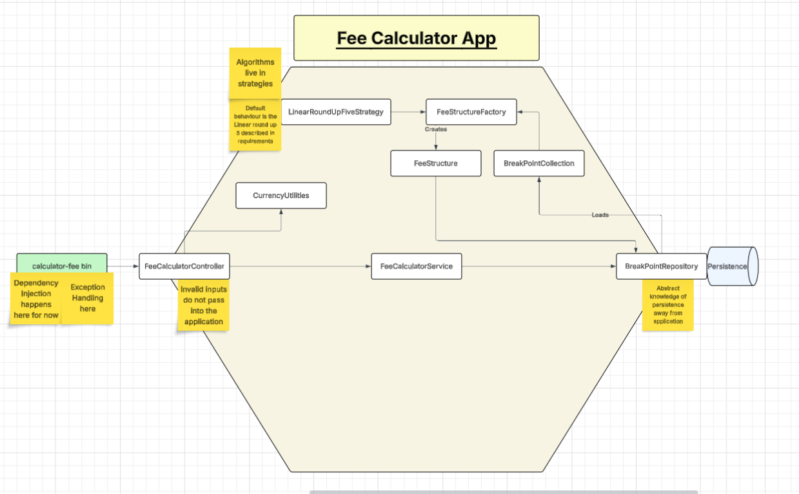
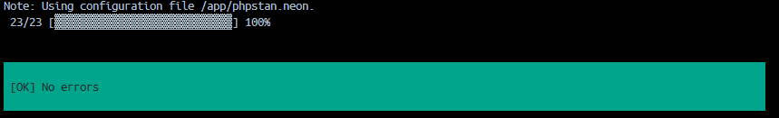
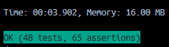

# Fee Checker

## Intro

Hi Lendable!

I have thoroughly enjoyed completing this test for you. It has been a great mix of architectural challenges, some
algorithmic complexity and awareness of PHP quirks.

Throughout the test, I have attempted to slightly overengineer the solution in order to demonstrate knowledge of some
common design patterns, hexagonal architecture, SOLID principles, DDD and clean code. I wrote much of the code using TDD
due to the high amount of precision in the requirements document - which was great fun!

I started with an "integration" test around the `calculate-fee` endpoint but eventually moved the functionality into
classes and the application structure that you can see. Then, I added unit tests as I fleshed out certain classes.

I hope you enjoy reviewing it as much as I enjoyed writing it.

Mike

## Demonstrative App Structure

## Project Dependencies

- You must have docker desktop installed

## Booting the Project

In the root of the project directory, run:

1. `docker-compose up -d` <-- note that the container will idle on boot so the `-d` is optional but gives you back your
   terminal window.
2. Either run `docker-compose exec -it php-service sh` from the root of the project, or enter the container via the Exec
   tab in the Docker Desktop GUI.

## Development

`docker compose up -d --build` <-- Force rebuild
`composer qa` <-- from within the project root when SSHd into the container. Runs phpstan and phpunit tests.

## Quality Control

- Level 10 PHPStan

  
- Comprehensive Unit Test Coverage

  

## Extensibility

- Interfaces provide a high level of abstraction
- Strategy pattern allows novel algorithm implementations with minor blast radius
    - E.g: round up to nearest 10
    - E.g: implement something non linear
- `FeeStructure` domain object is a confluence of a breakpoint collection and a strategy, allowing a mix-and match of
  strategies and term lengths with a minor blast radius
- Built with hexagonal architecture in mind, the public interface of the `FeeCalculatorService` is protected from
  knowledge of the "request vector" by the `FeeCalculatorController`. A web controller could be built to process and
  validate web requests into a format that the domain can understand
- The `FeeStructureRepositoryInterface` protects the domain layer from knowledge of its persistence. This could be
  reimplemented to load data from a database instead of from the filesystem (which is effectively what I have done with
  the two BreakPoint classes).
- Dependencies can be injected in the `calculate-fee` binary, allowing, for example, different FeeStructureFactory
  implementations to be provided, allowing different strategies to be injected.
- Eventually, I felt that dealing in integer pence was going to be a limit to extensibility. So, I imported a value
  object library to cover `Money` usages

## Further Development

Given more time I would:

- Import a dependency injection container with autowiring etc etc
- I might consider triggering the factory build method inside the service rather than in a repository. This kindof sits
  outside the repository's area of concern.
- I tend to find the `Service` name a bit generic, my services tend to follow the `facade` pattern; providing abstracted
  access to a subsystem. I'd probably rename it.
- Review the decision to handle all currencies in pence.
- I think some kind of "View" would be useful even though we are currently just outputting scalar responses. I feel that
  the `CurrencyUtilities` class may be taking on some of the responsibilities of a view.
- More detailed `Exceptions`. I am currently just using generic exception classes but more granularity and specificity
  could be provided if I made specific exception classes.
- Consider whether Exceptions should be caught in the controller and responses boiled down into some kind of response
  object? <-- This feels like a good idea
- I would probably change the value object library to https://github.com/moneyphp/money and enable `BCMath` extension -
  it seems to have better support for mathematical operations which would benefit the strategy patterns well. For now, I
  think there is value in using a value object to form the contracts between classes rather than just passing around
  integers.
- The strategy itself has too many concerns. I would think this could be more composable.
    - Round up strategy with optional integer
    - Linear fee inference between breakpoints strategy
- I might implement a builder pattern for the strategy so that we can compose "Linear" with "RoundUpTo" or "RoundDownTo"

## Requirements (Short)

[x] Values in between the breakpoints should be interpolated linearly between the lower bound and upper bound that they
fall between.

[x] The number of breakpoints, their values, or storage might change.

[x] The term can be either 12 or 24 (the number of months). You can also assume values will always be within this set.

[x] The fee should be rounded up such that the sum of the fee and the loan amount is exactly divisible by £5.

[x] The minimum amount for a loan is £1,000, and the maximum is £20,000.

[x] You can assume values will always be within this range but there may be any values up to 2 decimal places.